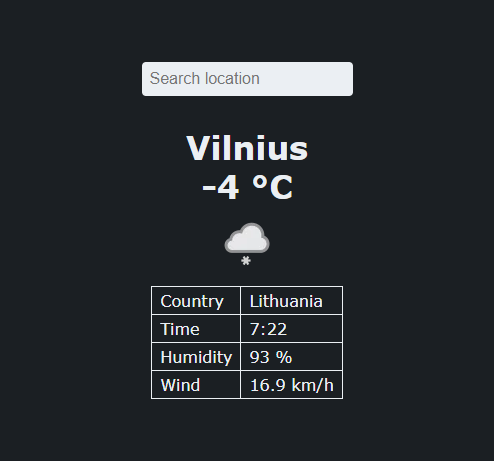

# Weatherly

Weatherly is a web app that I created to start learning [Angular](https://angular.io/). Weatherly consumes a free API ([weatherapi.com](https://www.weatherapi.com/)) to display weather in almost any location.

## Installation

1. Run `npm i` to install dependencies
2. Run `ng serve` to start a dev server
3. Navigate to `http://localhost:4200/`
